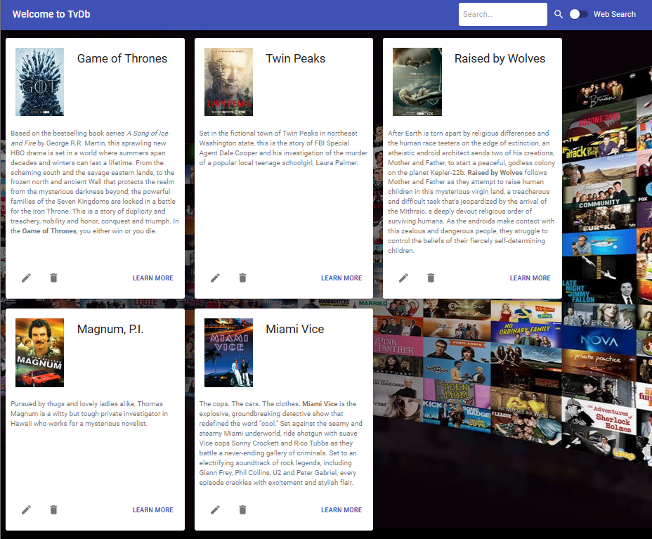

# TvDb demo application

A simple application to index locally various TvShow from [TvMaze](https://www.tvmaze.com/) server.



Enable "Web Search" to search on TvMaze, disable it to consult your local database.

You can edit the summary of each TvShow

In "web Search" click on the "+" button to add a TvShow to your local database. This will trigger a local search automatically.

## Requirements

- Open JDK 11
- Node 15.4.0
- Maven 3.6.2

## About

TvDb is a microservice written in the following frameworks:

- **Backend** is written with **SpringBoot**
- **FrontEnd** is written in **TypeScript** with **ReactJs** and **RxJs**

Folders:

- `./src/main/java` contains the server-side code
- `./src/main/react` contains the client-side code

## Web Entry points

### Open API  3.0 (Swagger)

```
http://localhost:8080/swagger-ui.html
```

### H2 Database console

```
http://localhost:8080/h2-console
```

### Service API

```
http://localhost:8080/api/tv
```

## How to build?

You can use the **mvnw** command provided by Spring boot or open the project in Eclipse. This will also test the server-side.

```bash
mvnw clean install
```

## How to Run?

Using **mvnw** (this also rebuild the gui)

```bash
mvnw spring-boot:run
```

Note: `spring-boot:run` does not run the tests.

Using directly **java**:

```
C:\Java\jdk-11.0.2\bin\java -jar target\TvDB-0.0.1-SNAPSHOT.jar
```

## How to test

### Test the client-side

Testing the front end occur in folder `./src/main/react/`

```
npm test
```

Since those tests contains integration tests (calls to the REST service), you are supposed to run it once the JAR is started. This can be done easily in Jenkins for instance...

### Test the server-side

This is done during the maven compilation

```
mvnw clean install
```

# Points of interest

## Server side

| Topic                                    | Class/Method/File                              | Description                                                  |
| ---------------------------------------- | ---------------------------------------------- | ------------------------------------------------------------ |
| REST Service                             | `TvApi`                                        | How to implement a REST service with CRUD operations. We use various HTTP methods (GET,POST,PUT,DELETE). The serialization of POJO into JSON is automatically done by the API. |
| JPA Repository                           | `TvDbRepository`                               | How to implement a JPA repository with practically no code.  |
| QBE API (Query by Example                | `TvApi:search()`                               | How to forge a request without writing SQL.                  |
| REST Client                              | `TvMaze`                                       | How to use RestTemplate API to consume the API from TvMaze server. |
| Open API                                 | `OpenApiConfig`                                | How to enable OpenAPI on a REST service to automatically provide a public schema. TvApi uses OpenAPI annotation (`@Operation` or `@Tag`) to add some comments on the public schema. |
| How to create a DB on startup            | `tvdb-schema.sql` and `application.properties` | Using `spring.datasource.schema` in the SpringBoot configuration, allow us to create the schema we want on startup. |
| Integrate Webpack build in the final JAR | `pom.xml`                                      | `exec-maven-plugin` will run `npm install` then `npm run build`. `maven-resources-plugin` will copy this build inside `${basedir}/target/classes/static` which is the default web root folder for the microservice. |
| API/Facade model                         | `com.hypercube.tvdb.api.model.*`               |                                                              |
| TvMaze model                             | `com.hypercube.tvdb. services.tvmaze.model.*`  |                                                              |
| DAO model                                |                                                | Since this service is very small, the DAO model is the same than the Facade |
| H2 Database                              | `application.properties`                       | The database in embed in the JAR. It will create a `./data/` folder to store the TvShows. |
| Tests                                    | `TvDbApplicationTests`                         | How to use `@SpringBootTest` to automatically run the microservice on a random TCP port and test it. |
| Log SQL queries                          | `application.properties`                       | `spring.jpa.show-sql=true`  and `spring.jpa.properties.hibernate.format_sql=true` |

## Client side

| Topic                                                        | Class/Method/File                                 | Description                                                  |
| ------------------------------------------------------------ | ------------------------------------------------- | ------------------------------------------------------------ |
| MaterialUI                                                   |                                                   | We use some widgets from [MaterialUI](https://material-ui.com/) Framework. |
| How to edit HTML summary and convert it to React             | `TvShowCard`                                      | we use `react-html-parser`                                   |
| How use RxJS to handle a shared state between widgets (Flux pattern) | `GlobalStore` and `ApplicatonStore`               | The `GlobalStore` is an event bus using RxJs containing a shared state (an object tree). Events are of the type `StoreUpdate`. As an example, we use a shared state for the search type (**external** or **internal**). The widget `TvDbBar` subscribes to the store, whereas the widget `App` send events to the store. `ApplicationStore` is a singleton inheriting from `GlobalStore`. |
| How to make a generic dialog to display errors and questions | `ConfirmDialog`                                   | We exports various enums that must be used in the widget properties. Depending on the type (**YESNO** or **ERROR**) one or two buttons will show up. A callback is used to receive the response (which button is selected). There is no visible/invisible state, you are supposed to remove the component from the virtual DOM when you no longer need it. |
| How to fix non-binded methods in ES6                         | `BaseComponent`                                   | It is well known that methods in ES6 classes are not bound to "this". It causes many troubles when you are using callbacks. People overuse "=>" operator to fix that (*lexical binding*). Here we use another technique: All widgets in the application inherit from `BaseComponent`. On creation, every methods starting by **'on'** will be automatically binded to **this** using the good old `bind` function of ES5. In this way the code will work properly and will be more readable than the "=>" technique to declare class methods. |
| Callbacks with Currying                                      | `ConfirmDialog`                                   | Sometimes you want to use the same callback with different parameters. Since react accept only a reference to a single function how to do that ? We use `bind` to do a Currying on the callback function. This is used in the dialog buttons with the callback `onClick` |
| REST Client                                                  | `TvDbService`                                     | We use **fetch** for simplicity but **axios** could be better for testing. The typed model is in `./src/model/` Typically this model should be automatically generated from the Open API Schema. |
| CSS Modules                                                  | `webpack.config.common.js` and `css-modules.d.ts` | We are using CSS Module with **less** preprocessor for all our widgets. In this way we avoid styling in JS and most of it: our styles are scoped. You can't have conflict if you are using the same CSS class in two widgets. It will be automatically renamed. |
| Tests                                                        | `./test/*`                                        | We use **Jest** with **Enzyme** to test our code.            |
| Test our RxJS Store                                          | `GlobalStore.test.ts`                             | We wrap the subscription of our store in a Promise. Then we can test it easily with Jest. |
| Test our REST client                                         | `TvDbService.test.ts`                             | We use node-fetch to be able to connect to the spring microservice. This is an integration test. We have to enforce a complete URL because all our services use relative urls. |
| Test a React Widget                                          | `ConfirmDialog.test.tsx`                          | We simulate a click on a dialog using Enzyme API. We also use **snapshots** to test what is rendered. |
| Project layout                                               |                                                   | We try to avoid tons of config files in the root folder. Most of the configuration is in `./config`. The webpack config is split in two files for **prod** and **dev**. There is also a common configuration. Jest configuration is also here. `HtmlWebpackPlugin` will use `./template/index.html`. It is clearly separated from the webroot folder (`./public/`). All tests are also separated from the code. They are in `./tests/`. External types or other TypeScript trickeries are in `./types/` |
| SourceMaps                                                   | `webpack.config.dev.js`                           | We use directly `SourceMapDevToolPlugin` to enforce `sourceRoot`. This is why, even in dev config we have `devtool: false` |
| Enzyme and React 17                                          | `./test/common/setup.ts`                          | Enzyme adapter support only React 16. So we don't use React 17 for now. |
| ESLint                                                       | `.eslintrc.js`                                    | We use rules from `@typescript-eslint/recommended`           |
